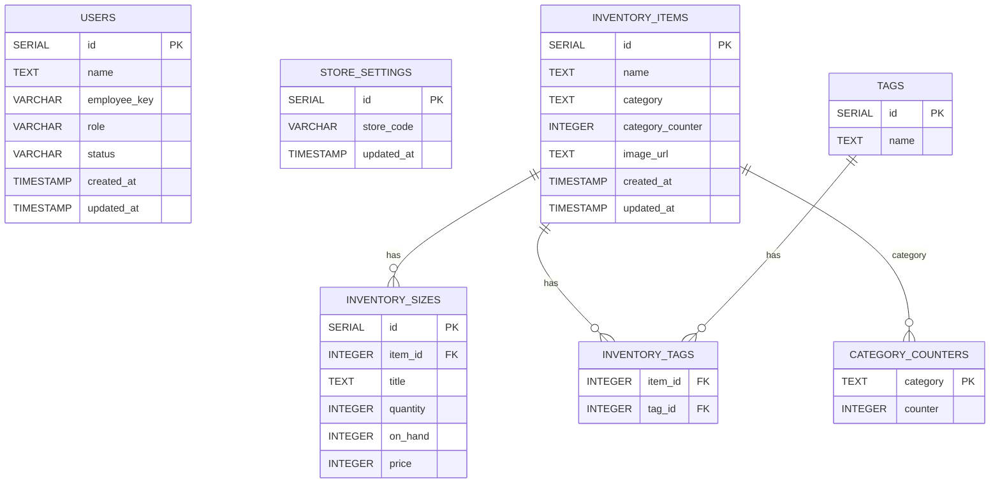

# Inventory & Database Documentation

## Visual ER Diagram

---

## Database Structure Summary

- **users**: User accounts and roles.
- **store_settings**: Store-wide settings (store code/password).
- **inventory_items**: Products.
  - `id`: Global unique serial.
  - `category_counter`: Per-category item number (for display).
- **category_counters**: Tracks the next available counter for each category.
- **tags**: Product tags.
- **inventory_sizes**: Size/variant info for each item.
- **inventory_tags**: Many-to-many join between items and tags.

### Relationships

- Each `inventory_item` can have many `inventory_sizes`.
- Each `inventory_item` can have many tags (via `inventory_tags`).
- Each tag can belong to many items (via `inventory_tags`).
- Each category in `inventory_items` is tracked in `category_counters` for per-category numbering.

## Inventory System Overview

The inventory system manages products, their categories, sizes, tags, and supports per-category item ID counters for unique, human-readable item codes.

### Key Features

- Each inventory item belongs to a category (e.g., Áo Dài, Quần, etc.)
- Each category has its own independent item counter, starting from 000001
- Items can have multiple sizes and tags
- All relationships are enforced with foreign keys

---

## Database Schema

### Tables

#### `users`

- Stores user accounts and roles.
- Columns: `id`, `name`, `employee_key`, `role`, `status`, `created_at`, `updated_at`

#### `store_settings`

- Stores store-wide settings, including the store code/password.
- Columns: `id`, `store_code`, `updated_at`

#### `inventory_items`

- Stores inventory items/products.
- Columns: `id` (manual, per-category), `name`, `category`, `image_url`, `created_at`, `updated_at`
- **ID Logic:** The `id` is assigned using a per-category counter (see `category_counters`).

#### `category_counters`

- Tracks the current counter for each category.
- Columns: `category` (PK), `counter`
- Used to generate the next item ID for each category independently.

#### `tags`

- Stores product tags.
- Columns: `id`, `name`

#### `inventory_sizes`

- Stores size/variant information for each item.
- Columns: `id`, `item_id` (FK), `title`, `quantity`, `on_hand`, `price`
- Foreign key: `item_id` references `inventory_items(id)`

#### `inventory_tags`

- Many-to-many join table between items and tags.
- Columns: `item_id` (FK), `tag_id` (FK)
- Foreign keys: `item_id` references `inventory_items(id)`, `tag_id` references `tags(id)`

---

## Inventory Item ID Generation

- When a new item is added, the system:
  1. Looks up the current counter for the item's category in `category_counters`.
  2. Increments the counter and assigns it as the new item's `id`.
  3. Formats the display ID as `XX-000001` (where `XX` is the category code, and the number is zero-padded).
- This ensures IDs are unique **per category** and easy to read.

---

## Example: Adding a New Item

1. User selects a category (e.g., "Áo Dài").
2. System fetches and increments the counter for "Áo Dài" in `category_counters`.
3. New item is inserted into `inventory_items` with the next available ID for that category.
4. Sizes and tags are linked via `inventory_sizes` and `inventory_tags`.

---

## Seeding

- The seed script only creates an admin user and sets the store password (store code) to `00000000`.
- No inventory or tag data is seeded by default.

---

## See Also

- [API Documentation](./API.md)
- [Architecture Overview](./ARCHITECTURE.md)
